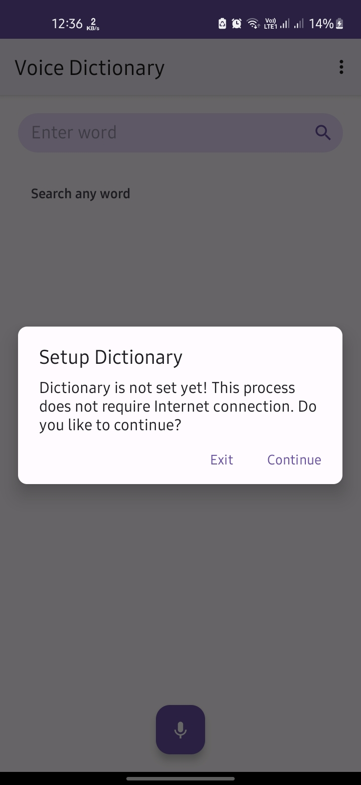
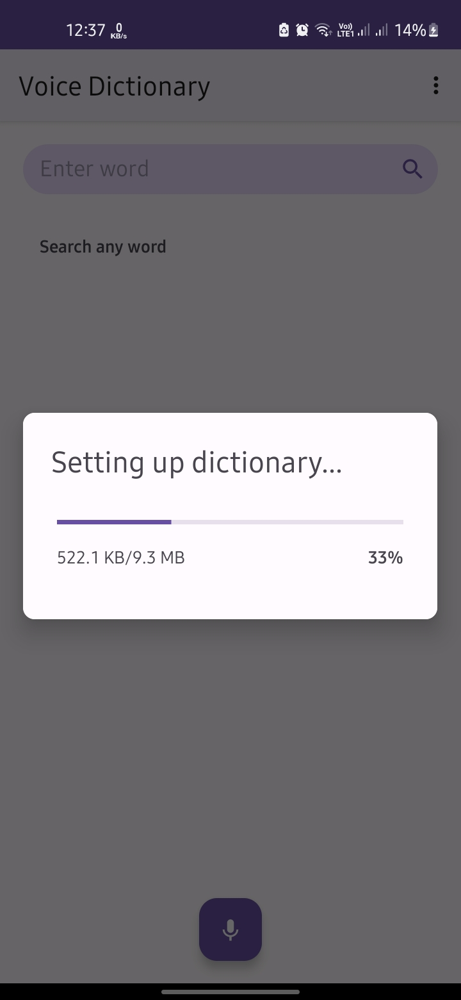
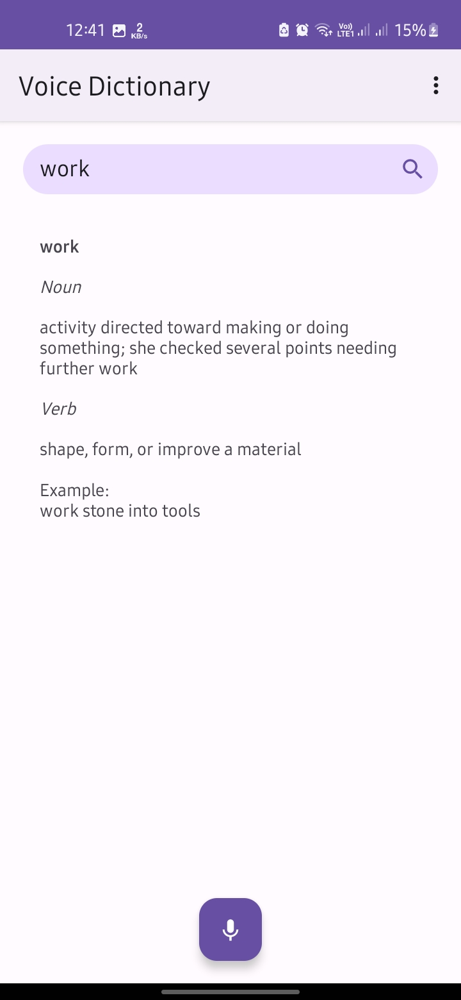

# VoiceDictionary

This is an open source project licensed under Apache 2.0.

## Description
This is an offline voice based dictionary app for Android. It accepts voice or text as input, and provides the definition and example as text and voice output.

#### Words
 1. Noun: 82170 Words
 2. Verb: 3730 Words
 3. Adjevctive: 1320 Words
 4. Adverb: 3230 Words

## Major Modules used
 1. Google Text To Speech
 2. Google Speech To Text
 3. WordNet's word asset. [View](https://wordnet.princeton.edu/download) (Modified to sql statements)
 
## Screenshots
    
    
  
## Attribution
  1. Include this [LICENSE](LICENSE) file if you are using this software or part of the software.
  2. Include WordNet's [LICENSE](https://wordnet.princeton.edu/license-and-commercial-use) file if you are using WordNet's word asset
  
## License
```
   Copyright 2022 Bhuvaneshwaran

   Licensed under the Apache License, Version 2.0 (the "License");
   you may not use this file except in compliance with the License.
   You may obtain a copy of the License at

       http://www.apache.org/licenses/LICENSE-2.0

   Unless required by applicable law or agreed to in writing, software
   distributed under the License is distributed on an "AS IS" BASIS,
   WITHOUT WARRANTIES OR CONDITIONS OF ANY KIND, either express or implied.
   See the License for the specific language governing permissions and
   limitations under the License.
   ```
